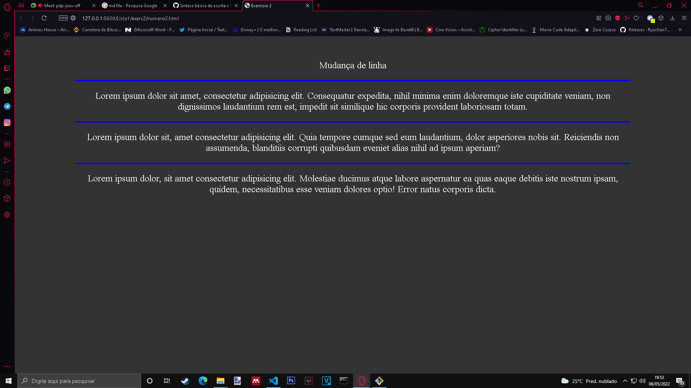
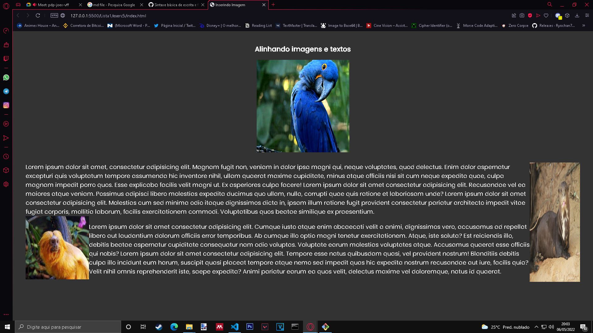
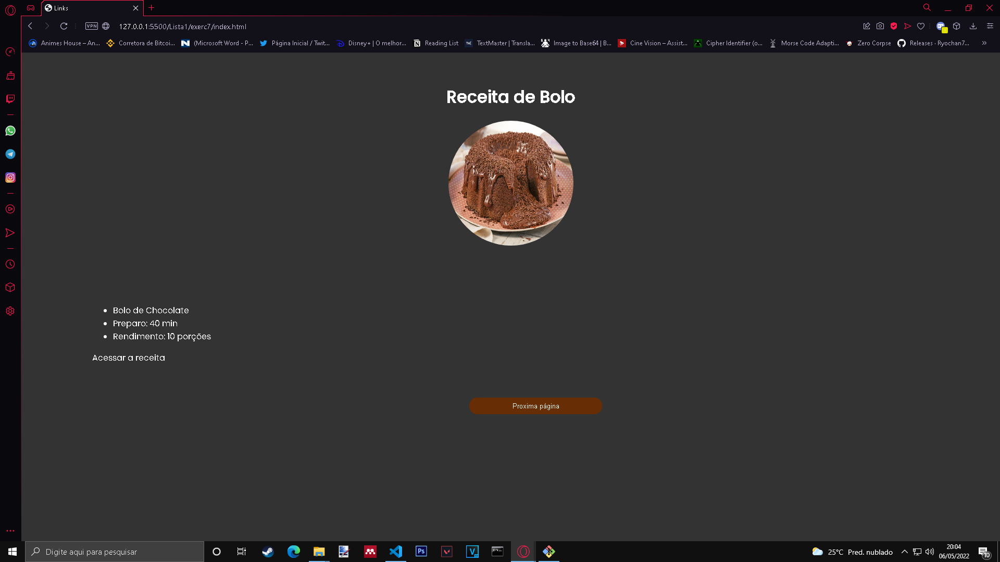
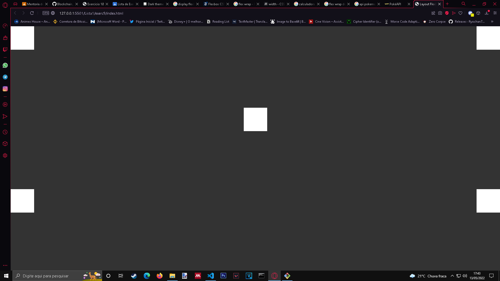

# Miscelânea
## **Exercicio 1**

## **Exercicio 2**

## **Exercicio 3**

## **Exercicio 4**

## **Exercicio 5**

## **Exercicio 6**

## **Exercicio 7**

## **Exercicio 8**

## **Exercicio 9**

## **Exercicio 10**

## **xercicio 11**
